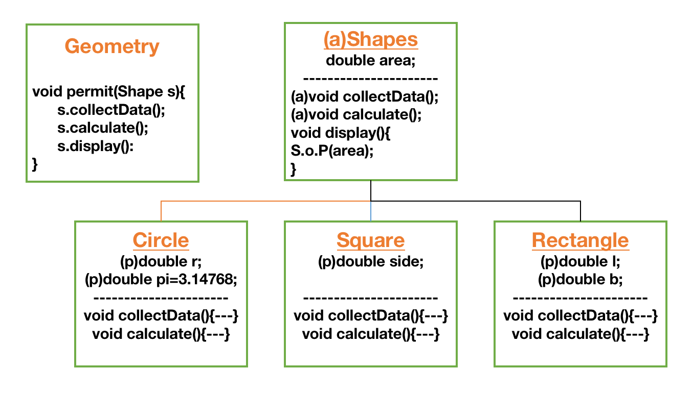

# Programming Fundamentals

### <b>1. What is a program?</b>
A program can be defined as the set of instructions given to the computer.

---
### <b>2. What is a compiler?</b>
A compiler is a software or a tanslator which converts the HLL(Source Code) into the MLL(Executable Code) simultaneously.

---
### <b>3. What is an interpreter?</b>
A interpreter is a software or a tanslator which converts the HLL(Source Code) into the MLL(Executable Code) line by line.

---
### <b>4. Who is the founder of java and what were the initial names of Java?</b>
The credit for the innovation of java goes to the <b>Green team</b> of Sun Microsystem led by James Gosling.
The initial names that were tried for java were:<br>
<li><b>C++++--</li>
<li>Green</li>
<li>Oak</li>
<li>Java :</b> it is the name of the cafe</li>

---
### <b>5. Why Java is called as the portable programming language?</b>
Java is called as the portable language because java program which is written and compiled in one Operating System can be executed any other operating system as well.

---
### <b>6. What is object?</b>
An object is defined as the real world entity which is also referred to as the instance of a class.

---
### <b>7. What is a class?</b>
A class is referred to as the blueprint of an object.

---
### <b>8. What is Object Orientation?</b>
An Object Orientation is defined as the perspective towards a real world entity.<br>
In Object Orientation we follow 5 important principles:
<li>The world is a collection of Objects</li>
<li>Every object is useful and no object is useless</li>
<li>Every Object is under constant interactions</li>
<li>Every object belongs to a type and the type in Object Orientation is called as <b>class</b>.</li>
<li>Every Object has something and every Object does something</li>


---
### <b>9. What are the major pillars of Object Orientation?</b>
<ol>
<br>
<b><li>Encapsulation:</b> It refers to the feature of providing the security to the most important component of an object </li><br>
<b><li>Inheritance:</b> It refers to the process of representing the data inform of parent child relationship, in other words it is the hierarchey of classes. </li><br>
<li><b>Polymorphism:</b> It represents 1:M relationship.<br>
Polymorphism is divided into 2 types:<br>
1. Compile time Polymorphism<br>
2. Runtime Polymorphism
</li><br>
<li><b>Abstraction: </b> It is the process of hiding the implementation in the Parent class and enforcing the Child class to provide the implementation</li>
</ol>

---

### <b>10. What is Encapsulation? What are the rules to be followed while encapsulating a program?</b>
It refers to the feature of providing the security to the most important component of an object.<br>
The rules to be followed while encapsulating the program are:<br>
<li>Use private members on the properties</li>
<li>Use Setter & Getters</li>

---
### <b>11. Write a program to Encapsulate a class in java.</b>
``` java

class Tiger{
	private String name;//Have access only within the Tiger Class
	private String color;//Have access only within the Tiger Class
	private int age;//Have access only within the Tiger Class
	private String country;//Have access only within the Tiger Class
	
	public String getName() {
		return name;
	}
	public void setName(String name) {
		this.name = name;
	}
	public String getColor() {
		return color;
	}
	public void setColor(String color) {
		this.color = color;
	}
	public int getAge() {
		return age;
	}
	public void setAge(int age) {
		this.age = age;
	}
	public String getCountry() {
		return country;
	}
	public void setCountry(String country) {
		this.country = country;
	}
	
	
}
public class Launch1 {
	public static void main(String[] args) {
		Tiger t1 = new Tiger();
		//t1.name="ramu";//Cannot access the private members outside the class
		t1.setName("ramu");
		t1.setAge(7);
		t1.setColor("orange");
		t1.setCountry("india");
		System.out.println(t1.getName());
		System.out.println(t1.getAge());
		System.out.println(t1.getColor());
		System.out.println(t1.getCountry());
	}

}

```
---
### <b>11. What is Inheritance? What are the advantages of using inheritance?</b>
It refers to the process of representing the data inform of parent child relationship, in other words it is the hierarchey of classes.<br>
Advantages of Inheritance is:<br>
<li>It promotes reusability of code</li>
<li>Since it reuses the code, it consumes lesser coding time</li>
<li>It brings profit for the organization</li>

Inheritance can be achieved by making use of <b>extends</b> keyword which promotes <b>is-a</b> relationship

---
### <b>12. What are the different types of methods in inheritance?</b>
In inheritance we have 3 different types of methods: <br>
<ol>
<li><b>Inherited Method:</b> These are the methods that are inherited from the parent class and used as it is in the child class.</li><br>
<li><b>Overridden Method:</b> These are the methods that are inherited from the Parent class but are modified as per the need in the child class.
</li><br>
<li><b>Specialized Method:</b> These are the methods that are not inherited from the parentb class but are present uniquely in the child class.
</li><br>
</ol>

---
### <b>13. Write a simple program to show case the usage of inheritance</b>
``` java
class Parent{
	//Inherited
	void eat() {
		System.out.println("eats food");
	}
	void sleep() {
		System.out.println("parent sleeps at 9pm");
	}
	//Inherited
	void run() {
		System.out.println("runs for 10km");
	}
}

class Child extends Parent{
	//Overriding---Overridden Method
	void sleep() {
		System.out.println("child sleeps at 1am");
	}
	void swims() {
		System.out.println("child swims");
	}
}
public class Launch2 {
	public static void main(String[] args) {
		Child c1 = new Child();
		c1.eat();
		c1.sleep();
		c1.run();
		c1.swims();
	}
}

```

---

### <b>14. What are loops in java? What are the different types of loops?</b> <br>
A loop basically is a feature in java to run a sequence of statements continuously untill a specific condition is met.<br>
There are basically 4 types of loops in java:<br>
<ol>
<li><b>for loop</b></li>
<li><b>while loop</b></li>
<li><b>do while loop</b></li>
<li><b>for each loop</b></li>
</ol>

---

### <b>15. What are conditional statement in java? What are the different types of conditional statements?</b> <br>
A conditional statement is used for executing a set of statement based on a particular condition.<br>
There are basically 4 types of condtional statements in java:<br>
<ol>
<li><b>if condition</b></li>
<li><b>else if condition</b></li>
<li><b>else condition</b></li>
<li><b>switch cases</b></li>
</ol>

---

### <b>16. What is a data-type? What are its types?</b></br>
A data types is defined as the type to which a particular data belongs to.<br>
We have 2 types of data-types:<br>
<ol>
<li><b> Primitive Data-Types : </b> byte, short, int, long, char, boolean, float, double, etc.(literals)</li>
<li><b> Non-Primitive Data-Types : </b>Wrapper Classes(Byte, Short, Integer, Long, Float, Character, Double, Boolean) (Other objects)
</ol>

---

### <b>17. What is type casting? Mention its types.</b>
A type casting is the process of converting one data-types into another data-type.<br>
<ul>
<li><b>Implicit Type Casting : </b> It is the process of converting one types of data into another type of data internally by the compiler.<br>
</ul>

``` java
public static void main(String[] args) {
		byte a = 10;
		int b;
		b=a;//implicit type casting
		System.out.println(b);
}
```

<li><b>Explicit Type Casting : </b> It is the process of converting one types of data into another type of data externally by the programmer.<br>

``` java
public static void main(String[] args) {
		int a = 10;
		byte b;
		b=(byte)a;//explicit type casting
		System.out.println(b);
	}
```

---

### <b>18. Pattern Program - 1</b><br>
``` java
/*
 * 1 2 3 4 5
 * 1 2 3 4 5
 * 1 2 3 4 5
 * 1 2 3 4 5
 * 1 2 3 4 5
 * 
 * Algorithm
 * --> It is in form of row x columns
 * --> we have 2 entities i.e row and column
 * --> we must have 2 loops to complete as we have 2 entities
 * --> row is represent by i
 * --> column(number) is represent by j
 */


import java.util.Scanner;
public class Code3 {
	public static void main(String[] args) {
		Scanner scan = new Scanner(System.in);
		System.out.println("User please enter the value of n : ");
		int n = scan.nextInt();// 5X5
		
		for(int i=1;i<=n;i++) {
			for(int j=1;j<=n;j++) {
				System.out.print(j+" ");
			}
			System.out.println();
		}
				
	}
}

```

---

### <b>19. Pattern Program - 2</b><br>

``` java
/*
 * 1 1 1 1 1
 * 2 2 2 2 2 
 * 3 3 3 3 3
 * 4 4 4 4 4
 * 5 5 5 5 5
 * 
 * 
 * --> It is in form of row x columns
 * --> we have 2 entities i.e row and column
 * --> we must have 2 loops to complete as we have 2 entities
 * --> row is represent by i
 * --> column(number) is represent by j
 */


import java.util.Scanner;
public class Code3 {
	public static void main(String[] args) {
		Scanner scan = new Scanner(System.in);
		System.out.println("User please enter the value of n : ");
		int n = scan.nextInt();// 5X5
		
		for(int i=1;i<=n;i++) {
			for(int j=1;j<=n;j++) {
				System.out.print(i+" ");
			}
			System.out.println();
		}
				
	}
}

```

### <b>20. Pattern Program - 3</b><br>

``` Java
/*
 * 1 	2 	3 	4 	5
 * 6 	7 	8 	9 	10
 * 11	12	13	14	15
 * 16	17	18	19	20
 * 21	22	23	24	25
 * 
 * --> It is in form of row x columns
 * --> we have 2 entities i.e row and column
 * --> we must have 2 loops to complete as we have 2 entities
 * --> row is represent by i
 * --> column(number) is represent by j
 * --> create a variable and initialize it count=1
 * --> print the count and increment it after printing it each time
 */


import java.util.Scanner;
public class Code3 {
	public static void main(String[] args) {
		Scanner scan = new Scanner(System.in);
		System.out.println("User please enter the value of n : ");
		int n = scan.nextInt();// 5X5
		int count=1;
		for(int i=1;i<=n;i++) {
			for(int j=1;j<=n;j++) {
				System.out.print(count+"	");
				count++;
			}
			System.out.println();
		}		
	}
}

```

---

### <b>21. Pattern Program - 4</b><br>

``` Java
/*
 * 01 	02 	03 	04 	05
 * 06 	07 	08 	09 	10
 * 11	12	13	14	15
 * 16	17	18	19	20
 * 21	22	23	24	25
 * 
 * --> It is in form of row x columns
 * --> we have 2 entities i.e row and column
 * --> we must have 2 loops to complete as we have 2 entities
 * --> row is represent by i
 * --> column(number) is represent by j
 * --> create a variable and initialize it count=1
 * --> print the count and increment it after printing it each time
 * --> apply a condition to check if the number is less than 10
 * 			--> if number is less than 10 then attach 0 to it
 * 			--> else print the number as it is
 */


import java.util.Scanner;
public class Code3 {
	public static void main(String[] args) {
		Scanner scan = new Scanner(System.in);
		System.out.println("User please enter the value of n : ");
		int n = scan.nextInt();// 5X5
		int count=1;
		for(int i=1;i<=n;i++) {
			for(int j=1;j<=n;j++) {
				if(count<10) {
					System.out.print("0");
					System.out.print(count+"	");
					count++;
				}
				else {
					System.out.print(count+"	");
					count++;
				}
			}
			System.out.println();
		}
				
	}
}

```

---

### <b>22. Pattern Program - 5</b><br>

``` java
/*
 * 1 0 1 0 1
 * 1 0 1 0 1
 * 1 0 1 0 1
 * 1 0 1 0 1
 * 1 0 1 0 1
 */

import java.util.Scanner;
public class Code3 {
	public static void main(String[] args) {
		Scanner scan = new Scanner(System.in);
		System.out.println("User please enter the value of n : ");
		int n = scan.nextInt();// 5X5
		for(int i=1;i<=n;i++) {
			for(int j=1;j<=n;j++) {
				if(j%2==0) {
					System.out.print("0 ");
				}
				else {
					System.out.print("1 ");
				}
			}
			System.out.println();
		}
				
	}
}
```
---

### <b>23. Pattern Program - 6</b><br>

``` java
/*
 * 1			--> row no: 1
 * 1 2			--> row no: 2
 * 1 2 3		--> row no: 3
 * 1 2 3 4		--> row no: 4
 * 1 2 3 4 5	--> row no: 5
 */

import java.util.Scanner;
public class Code3 {
	public static void main(String[] args) {
		Scanner scan = new Scanner(System.in);
		System.out.println("User please enter the value of n : ");
		int n = scan.nextInt();// 5X5
		for(int i=1;i<=n;i++) {
			for(int j=1;j<=i;j++) {
				System.out.print(j+" ");
			}
			System.out.println();
		}
				
	}
}

```
---

### <b>24. Pattern Program - 7</b><br>
``` java

/*
 * 1 # # # # #				
 * 1 2 # # # # #				
 * 1 2 3 # # # # #			
 * 1 2 3 4 # # # # #			
 * 1 2 3 4 5 # # # # #		
 * 
 * 1 				# # # # #				
 * 1 2 				# # # # #				
 * 1 2 3 			# # # # #			
 * 1 2 3 4 			# # # # #			
 * 1 2 3 4 5 		# # # # #		
 */

import java.util.Scanner;
public class Code3 {
	public static void main(String[] args) {
		Scanner scan = new Scanner(System.in);
		System.out.println("User please enter the value of n : ");
		int n = scan.nextInt();// 5X5
		for(int i=1;i<=n;i++) {
			for(int j=1;j<=i;j++) {
				System.out.print(j+" ");
			}
			for(int j=1;j<=n;j++) {
				System.out.print("# ");
			}
			System.out.println();
		}
				
	}
}

```
---

### <b>25. Pattern Program - 8</b><br>

``` java
/*
 * 5 4 3 2 1 # # # # #				
 * 5 4 3 2 # # # # #				
 * 5 4 3 # # # # #			
 * 5 4 # # # # #			
 * 5 # # # # #		
 * 
 * 5 4 3 2 1 		# # # # #				
 * 5 4 3 2			# # # # #				
 * 5 4 3 			# # # # #			
 * 5 4 				# # # # #			
 * 5 				# # # # #		
 */

import java.util.Scanner;
public class Code3 {
	public static void main(String[] args) {
		Scanner scan = new Scanner(System.in);
		System.out.println("User please enter the value of n : ");
		int n = scan.nextInt();// 5X5
		for(int i=1;i<=n;i++) {
			for(int j=n;j>=i;j--) {
				System.out.print(j+" ");
			}
			for(int j=1;j<=n;j++) {
				System.out.print("# ");
			}
			System.out.println();
		}
				
	}
}

```

---

### <b>26. Pattern Program - 9</b><br>

``` java
/*
 * 1	6	11	16	21
 * 2	7	12	17	22
 * 3	8	13	18	23
 * 4	9	14	19	24
 * 5	10	15	20	25
	
 */

import java.util.Scanner;
public class Code3 {
	public static void main(String[] args) {
		Scanner scan = new Scanner(System.in);
		System.out.println("User please enter the value of n : ");
		int n = scan.nextInt();// 5X5
		int count;
		for(int i=1;i<=n;i++) {
			count=i;
			for(int j=1;j<=n;j++) {
				System.out.print(count+"	");
				count=count+n;
			}
			System.out.println();
		}
				
	}
}

```
---

### <b>27. Pattern Program - 10</b><br>

``` java
/*
 * # # # # # 1
 * # # # # 2 2 2 
 * # # # 3 3 3 3 3
 * # # 4 4 4 4 4 4 4
 * # 5 5 5 5 5 5 5 5 5
 * 
 * 
 * # # # # # 			1				---> 1 ---> 2*i-1 => 2*1-1=1
 * # # # # 			  2 2 2 			---> 3 ---> 2*i-1 => 2*2-1=3
 * # # # 			3 3 3 3 3			---> 5 ---> 2*i-1 => 2*3-1=5
 * # # 			  4 4 4 4 4 4 4			---> 7 ---> 2*i-1 => 2*4-1=7
 * # 			5 5 5 5 5 5 5 5 5		---> 9 ---> 2*i-1 => 2*5-1=9
 */

import java.util.Scanner;
public class Code3 {
	public static void main(String[] args) {
		Scanner scan = new Scanner(System.in);
		System.out.println("User please enter the value of n : ");
		int n = scan.nextInt();// 5X5
		for(int i=1;i<=n;i++) {
			for(int j=n;j>=i;j--) {
				System.out.print("# ");
			}
			
			for(int j=1;j<=2*i-1;j++) {
				System.out.print(i+" ");
			}
			System.out.println();
		}
				
	}
}
```
---

### <b>27. Pattern Program - 10</b><br>

``` java
/*
 * Program to create a simple calculator application using switch cases
 */

import java.util.Scanner;
public class Code3 {
	public static void main(String[] args) {
		Scanner scan = new Scanner(System.in);
		System.out.println("User please enter the operation to be performed : \n+"
				+ "1. Addition\n"
				+ "2. Subtraction\n"
				+ "3. Multiplication\n"
				+ "4. Division");
		int op = scan.nextInt();
		int val;
		switch (op) {
		case 1: {
			System.out.println("Addition Operartion is invoked.");
			System.out.println("Enter the value no: 1: ");
			int num1 = scan.nextInt();
			System.out.println("Enter the value no: 2: ");
			int num2 = scan.nextInt();
			val = num1 + num2;
			System.out.println("The result of addition is : "+val);
			break;
		}
		case 2: {
			System.out.println("Subtraction Operartion is invoked.");
			System.out.println("Enter the value no: 1: ");
			int num1 = scan.nextInt();
			System.out.println("Enter the value no: 2: ");
			int num2 = scan.nextInt();
			val = num1 - num2;
			System.out.println("The result of subtraction is : "+val);
			break;
		}
		case 3: {
			System.out.println("Multiplication Operartion is invoked.");
			System.out.println("Enter the value no: 1: ");
			int num1 = scan.nextInt();
			System.out.println("Enter the value no: 2: ");
			int num2 = scan.nextInt();
			val = num1 * num2;
			System.out.println("The result of multiplication is : "+val);
			break;
		}
		case 4: {
			System.out.println("Division Operartion is invoked.");
			System.out.println("Enter the value no: 1: ");
			int num1 = scan.nextInt();
			System.out.println("Enter the value no: 2: ");
			int num2 = scan.nextInt();
			val = num1 / num2;
			System.out.println("The result of division is : "+val);
			break;
		}
		default:
			System.out.println("wrong input selected");
		}
	}
}

```

---

### <b>28. What are String in Java?</b><br>
A String is defined as the series of characters which is enclosed within the double quotes(" ").

---

### <b>29. What are the different types of Strings in Java?</b><br>
In java strings are classified into 2 types:<br>
<ol>
<li>Mutable Strings</li>
<li>Immutable Strings</li>
</ol>

--- 
### <b>30. What is a Immutable strings in java? How do we represent them?</b><br>
These are the String which will not change once it is created.
It is represent using <b>java.lang.String class</b>

---

### <b>31. What is a Mutable strings in java? How do we represent them?</b><br>
These are the String which can change once it is created.
It is represent using : <br>
<ol>
<li><b>java.lang.StringBuffer class</b></li>
<li><b>java.lang.StringBuilder class</b></li>
</ol>

---

### <b>32. Palindrome Program</b><br>

``` java
import java.util.Scanner;

/*
 * Given the following 
 * input	: madam
 * Output	: Given String is a palindrome

 note: 
 next()--> used for collecting single word
 nextLine()--> used for collecting a statement

 */

public class Code4 {
	public static void main(String[] args) {
		Scanner scan = new Scanner(System.in);
		System.out.println("Enter the String: ");
		String str = scan.next();
		String str1="";
		
		/*
	   	 i		
	 	 0	1	2	3	4
	str	 m	a	d	a	m
		 
	str1 m	a 	d	a	m	 
		 */
		
		for(int i=str.length()-1;i>=0;i--) {
			str1=str1+str.charAt(i);
		}
		
		if(str.equals(str1)==true) {
			System.out.println("Given String is a palindrome");
		}
		else {
			System.out.println("Given String is not a palindrome");
		}
		
	}
}

```
---

### <b>33. Count Vowels</b><br>
``` java
import java.util.Scanner;

/*
 * input	: HEllO GooD Morning
 * Output	: Vowel Count = 6
 */
public class Code5 {
	public static void main(String[] args) {
		Scanner sc = new Scanner(System.in);
		System.out.println("Please enter the String: ");
		String str = sc.nextLine();
		int vowel_cnt=0;
		
		for(int i=0;i<str.length();i++) {
			if(str.charAt(i)=='a'||str.charAt(i)=='e'||str.charAt(i)=='i'||str.charAt(i)=='o'
				|| str.charAt(i)=='u') {
				vowel_cnt++;
			}
			else if(str.charAt(i)=='A'||str.charAt(i)=='E'||str.charAt(i)=='I'||str.charAt(i)=='O'
					|| str.charAt(i)=='U') {
				vowel_cnt++;
			}
			else {
				
			}
		}
		System.out.println("Vowel Count is = "+vowel_cnt);
	}
}

```
---

### <b>34. Word count.</b><br>

``` java
import java.util.Scanner;

/*
 * input	: Hello GooD Morning
 * Output	: Word Count = 3
 */
public class Code5 {
	public static void main(String[] args) {
		Scanner sc = new Scanner(System.in);
		System.out.println("Please enter the String: ");
		String str = sc.nextLine();
		int word_cnt=0;
		
		for(int i=0;i<str.length();i++) {
			if(str.charAt(i)==' ' && str.charAt(i+1)!=' ') {
				word_cnt++;
			}
		}
		word_cnt++;
		System.out.println("Word Count is = "+word_cnt);
	}
}


```
---

### <b>35. Replace vowels.</b><br>
``` java
import java.util.Scanner;

/*
 * input	: Hello GooD Morning
 * Output	: H@ll@ G@@D M@rn@ng
 */
public class Code5 {
	public static void main(String[] args) {
		Scanner sc = new Scanner(System.in);
		System.out.println("Please enter the String: ");
		String str = sc.nextLine();
		int word_cnt=0;
		String str1="";
		
		for(int i=0;i<str.length();i++) {
			if(str.charAt(i)=='a' || str.charAt(i)=='e' ||
					str.charAt(i)=='i' || str.charAt(i)=='o'
					|| str.charAt(i)=='u' || str.charAt(i)=='A' || str.charAt(i)=='E' ||
					str.charAt(i)=='I' || str.charAt(i)=='O'
					|| str.charAt(i)=='U') {
				str1 = str1 + '@';
			}
			else {
				str1 = str1 + str.charAt(i);
			}
		}
		System.out.println("Word Count is = "+str1);
	}
}

```
---

### <b>36. Replace Vowels with special character indivitually.</b><br>
``` java
import java.util.Scanner;

/*
 * input	: aeiouAEIOU
 * Output	: @#$%&@#$%&
 */
public class Code5 {
	public static void main(String[] args) {
		Scanner sc = new Scanner(System.in);
		System.out.println("Please enter the String: ");
		String str = sc.nextLine();
		int word_cnt=0;
		String str1="";
		
		for(int i=0;i<str.length();i++) {
			if(str.charAt(i)=='a' || str.charAt(i)=='A') {
				str1 = str1 + '@';
			}
			else if(str.charAt(i)=='e' || str.charAt(i)=='E') {
				str1 = str1 + '#';
			}
			else if(str.charAt(i)=='i' || str.charAt(i)=='I') {
				str1 = str1 + '$';
			}
			else if(str.charAt(i)=='o' || str.charAt(i)=='O') {
				str1 = str1 + '%';
			}
			else if(str.charAt(i)=='u' || str.charAt(i)=='U') {
				str1 = str1 + '&';
			}
			else {
				str1 = str1 + str.charAt(i);
			}
		}
		System.out.println("Word Count is = "+str1);
	}
}

```
---

### <b>36. Segregation of Strings.</b><br>
```java
/*
 * input	: He#$%%^ll&&&&o Goo^^%$$##d Mo$%^&rn$%^&ing Wel&*(co*&%$#me o%n bo$%^&ar#$%^d
 * Output	: HelloGoodMorningWelcomeonbaord
 * 			  #$%%^ll&&&&^^%$$##$%^&$%^&&*(*&%$#%$%^&#$%^
 */
public class Code5 {
	public static void main(String[] args) {
		Scanner sc = new Scanner(System.in);
		System.out.println("Please enter the String: ");
		String str = sc.nextLine();
		String str1="";
		String str2="";
		
		
		for(int i=0;i<str.length();i++) {
			if((str.charAt(i)>='a' && str.charAt(i)<='z') || 
					(str.charAt(i)>='A' && str.charAt(i)<='Z')) {
				str1 = str1 + str.charAt(i);
			}
			else {
				str2=str2+str.charAt(i);
			}
		}
		System.out.println("Character String is = "+str1);
		System.out.println("Symbols String is = "+str2);
	}
}
```
---

### <b>37. <b>What is an Array Data Structure in Java?</b><br></b>

An Arrays is defined as the collection Homogeneous data(similar data).

---

### <b>38. What are the advantages of array datastructure?</b><br>
There are 3 important advanatges of array data structure:<br>
<ol>
<li>Creation of an array is simple</li>
<li>Storing the data inside an array is simple</li>
<li>Retrieving the data from an array is simple</li>
</ol>

---

### <b>39. Program on 1-Dimension Array</b><br>
``` java
import java.util.Scanner;

/*
 * Program to store and retrieve name of the employees
 */
public class ArraysCode1 {
	public static void main(String[] args) {
		Scanner sc = new Scanner(System.in);
		System.out.println("Enter to number of employee: ");
		int n = sc.nextInt();//5
		/*
		 * [] 		----> 1-Dimension array
		 * [][]		----> 2-Dimension array
		 */
		String arr[] = new String[n];

		//Storing the data
		for(int i=0;i<arr.length;i++) {
			System.out.println("Enter the name of the Employee no: "+(i+1));
			arr[i]=sc.next();
			/*
			 * arr[0]=Rohit
			 * arr[1]=Gill
			 * arr[2]=Virat
			 * arr[3]=Surya
			 * arr[4]=MSD
			 */
		}
		//Fetching the data
		for(int i=0;i<arr.length;i++) {
			System.out.println("the name of the Employee no: "+(i+1)+" is = "+arr[i]);
		}
	}
}

```
---
### <b>40. Program on 2-Dimensional Array.</b><br>
``` java
import java.util.Scanner;

/*
 *  Company		Employee
 *     0			3
 *     1			3
 *     2			3
 *     3			3
 *     
 *  Write a code to collect the names of employees from each company
 * 
 * 2 entities ----> 2 loops ----> 2 [] ----> 2-Dimensional Array
 */
public class ArraysCode1 {
	public static void main(String[] args) {
		Scanner sc = new Scanner(System.in);
		System.out.println("Enter to number of companies: ");
		int m = sc.nextInt();//5

		System.out.println("Enter to number of employees in each company: ");
		int n = sc.nextInt();//5

		String arr[][] = new String[m][n];

		//Storing the data
		for(int i=0;i<arr.length;i++) //companies
		{
			System.out.println("Inside company no: "+(i+1));

			for(int j=0;j<arr[i].length;j++) {
				System.out.println("Enter the name of employee no:"+(j+1));
				arr[i][j]=sc.next();
			}
			/*
			 * arr[0][0]=Rohit
			 * arr[0][1]=Gill
			 * arr[0][2]=Virat
			 * -----------------
			 * arr[1][0]=Surya
			 * arr[1][1]=MSD
			 * arr[1][2]=Raina
			 * -----------------
			 * arr[2][0]=Rahul
			 * arr[2][1]=Kaif
			 * arr[2][2]=Yuvraj
			 * -----------------
			 * arr[3][0]=Sachin
			 * arr[3][1]=Laxman
			 * arr[3][2]=Balaji
			 */
		}
		//Fetching the data
		for(int i=0;i<arr.length;i++) //companies
		{
			System.out.println("Inside company no: "+(i+1));

			for(int j=0;j<arr[i].length;j++) {

				System.out.println("the name of the Employee no: "+(j+1)+" is = "+arr[i][j]);
			}
		}
	}
}
```
---
### <b>41. Program on 3-Dimensional array</b><br>
``` java
import java.util.Scanner;

/*
 *  Organization Company	Employee
 *   	0		    0			3
 *   				1			3
 *     	1			0			3
 *     				1			3
 *     
 *  Write a code to collect the names of employees from each company
 * 
 * 2 entities ----> 2 loops ----> 2 [] ----> 2-Dimensional Array
 */
public class ArraysCode1 {
	public static void main(String[] args) {
		Scanner sc = new Scanner(System.in);
		System.out.println("Enter to number of organizations: ");
		int a = sc.nextInt();//5

		System.out.println("Enter to number of companies in each organization: ");
		int m = sc.nextInt();//5

		System.out.println("Enter to number of employees in each company of each organization: ");
		int n = sc.nextInt();//5

		String arr[][][] = new String[a][m][n];//---> 3-D

		//Storing the data
		for(int i=0;i<arr.length;i++) //companies
		{
			System.out.println("Inside organization no: "+(i+1));

			for(int j=0;j<arr[i].length;j++) //companies
			{
				System.out.println("Inside company no: "+(j+1));

				for(int k=0;k<arr[i][j].length;k++) {
					System.out.println("Enter the name of employee no:"+(k+1));
					arr[i][j][k]=sc.next();
				}
			}
			/*
			 * arr[0][0][0]=Rohit
			 * arr[0][0][1]=Gill
			 * arr[0][0][2]=Virat
			 * arr[0][1][0]=Rohit
			 * arr[0][1][1]=Gill
			 * arr[0][1][2]=Virat
			 * 
			 * arr[1][0][0]=Rohit
			 * arr[1][0][1]=Gill
			 * arr[1][0][2]=Virat
			 * arr[1][1][0]=Rohit
			 * arr[1][1][1]=Gill
			 * arr[1][1][2]=Virat
			 */
		}
		//Fetching the data
		for(int i=0;i<arr.length;i++) //companies
		{
			System.out.println("Inside organization no: "+(i+1));

			for(int j=0;j<arr[i].length;j++) //companies
			{
				System.out.println("Inside company no: "+(j+1));

				for(int k=0;k<arr[i][j].length;k++) {

					System.out.println("the name of the Employee no: "+(k+1)+" is = "+arr[i][j][k]);
				}
			}
		}
	}
}
```
---
### <b>42. What is method overloading? / What is compile time polymorphism? / What is virtual polymorphism?</b> <br>
A method overloading is the illusion in the minds of the programmer that one single method will be performing multiple tasks. But, inreality it is the independent methods which will be performing the independent tasks.<br>
In method overloading the methods can have same name, same number of parameters, same type of parameter but it cannot have the parameters in same order.<br>

It is also called Virtual Polymporphsim.<br>
Virtual 		----> Not Real<br>
Polymorphism	----> 1:M<br>

It is also called compile time polymorphism because this polymorphic approach is seen during the compilation time.
``` java
class Calculator{
	int add(int a,int b) {
		return a+b;
	}
	int add(int a,int b,int c) {
		return a+b;
	}
	float add(int a, float b) {
		return a+b;
	}
	float add(float a, int b) {
		return a+b;
	}
	float add(float a, float b) {
		return a+b;
	}
	double add(int a, float b, double c) {
		return a+b+c;
	}
	double add(float a, int b, double c) {
		return a+b+c;
	}
	double add(float a, double b, int c) {
		return a+b+c;
	}
}
public class Launch3 {
	public static void main(String[] args) {
		int a=10,b=20,c=30;
		float a1=10.11f,b1=20.22f,c1=30.33f;
		double a2=100.111,b2=200.222,c2=300.333;
		
		Calculator cal = new Calculator();
		System.out.println(cal.add(a,b));//int,int
		System.out.println(cal.add(a1, b1));//float,float
		System.out.println(cal.add(a, b1, c2));//int,float.double
	}
}

```
---
### <b>43. What is the use of static keyword? Does making a variable static makes it constant? Justify. </b><br>
Static Basically is used to create the memory only once in the static segment. 
In static segment we have 3 important members :<br>
<ol>
<li>static variable</li>
<li>static block</li>
<li>static method</li>
</ol>
No, making a variable static makes it to get the memory only once which can be accessed multiple times. The static variables is not a constant.
<br>
<ul>
<li>Static members are VIP members</li>
<li>Program execution will always start from static segment</li>
<li>In-order to call the static method even before creating the object we make use of the class name</li>
<li>Static variables are the instance variables with the static keyword associated with it</li>
<li>Static varibales get default values assigned</li>
</ul>

``` java
class SampleTest{
	static int a,b,c;//static variables --->1
	int m,n,o;//non-static variables

	//static block -- can access only static variables --->2
	static 
	{
		a=100;
		b=200;
		c=300;
//		m=1000;//error
//		n=2000;//error
//		o=3000;//error
	}

	//Non-static block -- can access both static and non-static variables
	{
		a=1001;
		b=2001;
		c=3001;
		m=10001;
		n=20001;
		o=30001;
	}

	//static methods -- can access only static variables
	static void display(){
		System.out.println(a);
		System.out.println(b);
		System.out.println(c);
//		System.out.println(m);//error
//		System.out.println(n);//error
//		System.out.println(o);//error
	}
	//static methods -- can access both static and non-static variables
	void display1(){
		System.out.println(a);
		System.out.println(b);
		System.out.println(c);
		System.out.println(m);
		System.out.println(n);
		System.out.println(o);
	}

}
public class Launch4 {
	public static void main(String[] args) {
		System.out.println(SampleTest.a);
		System.out.println(SampleTest.b);
		System.out.println(SampleTest.c);
		System.out.println("---------");
		SampleTest st = new SampleTest();
		st.display1();
		System.out.println("---------");
		st.display();
	}
}

```
---
### <b>45. Programming example for static.</b><br>
``` java
import java.util.Scanner;

class Farmer{
	double principle;
	static double rate;
	double time;
	double simpleInterest;
	
	static {
		rate=2.5;//memory for rate will be created only once for all the objects
	}
	void collectData() {
		Scanner sc = new Scanner(System.in);
		System.out.println("Enter the Principle Amount: ");
		principle=sc.nextDouble();
		
		System.out.println("Enter the Time Needed (In Years): ");
		time=sc.nextDouble();
		
	}
	void calculate() {
		simpleInterest = (principle * time * rate)/100;
	}
	
	void showSimpleInterest() {
		System.out.println("The Simple Interest is : "+simpleInterest);
	}
}
public class Launch5 {
	public static void main(String[] args) {
		Farmer f1 = new Farmer();
		Farmer f2 = new Farmer();
		Farmer f3 = new Farmer();
		
		f1.collectData();
		f2.collectData();
		f3.collectData();
		
		f1.calculate();
		f2.calculate();
		f3.calculate();
		
		System.out.println("Simple Interest for First farmer is : ");
		f1.showSimpleInterest();
		System.out.println("Simple Interest for Second farmer is : ");
		f2.showSimpleInterest();
		System.out.println("Simple Interest for Third farmer is : ");
		f3.showSimpleInterest();
		
	}
}

```
---
### <b>46. What is a constructor? What are the different types of constructors?</b><br>
A constructor is a special type of setter method which has the name same as the class name and it doesn't have any return type.<br>
A constructor will automatically get invoked during the object creation.<br>
The first line inside the constructor is always the call for the super(). Even if the programmer doesn't mention it the compiler will automatically add it.<br>
There are 2 types of constructors :<br>
1. Zero parameterized constructor
2. Parameterized constructor

``` java
/*
It refers to the process of providing security to the 
most important component of an object
--> Private members
--> Setters and Getters
--> Conditional Statements if needed


*/
class Dog{
	private String name;
	private String color;
	private int cost;
	private int age;
	private String breed;
	
	//zero parameterized 
	Dog(){
		super();
		name = "rocky";
		color = "black";
		cost = 6000;
		age = 3;
		breed = "GR";
	}
	
	public void setName(String name) {
		this.name = name;
	}

	public void setColor(String color) {
		this.color = color;
	}

	public void setCost(int cost) {
		this.cost = cost;
	}

	public void setAge(int age) {
		this.age = age;
	}

	public void setBreed(String breed) {
		this.breed = breed;
	}

	public String getName() {
		return name;
	}
	public String getColor() {
		return color;
	}
	public int getCost() {
		return cost;
	}
	public int getAge() {
		return age;
	}
	public String getBreed() {
		return breed;
	}
}
public class EncapsulationCode1 {
	public static void main(String[] args) {
		Dog d = new Dog();
		System.out.println(d.getName());
		System.out.println(d.getAge());
		System.out.println(d.getColor());
		System.out.println(d.getCost());
		System.out.println(d.getBreed());
		d.setName("Tommy");
		System.out.println(d.getName());
	}
}


```
``` java

class Dog{
	private String name;
	private String color;
	private int cost;
	private int age;
	private String breed;
	
	//parameterized 
	Dog(String a,String b,int c, int d, String e){
		super();
		name = a;
		color = b;
		cost = c;
		age = d;
		breed = e;
	}
	

	public String getName() {
		return name;
	}
	public String getColor() {
		return color;
	}
	public int getCost() {
		return cost;
	}
	public int getAge() {
		return age;
	}
	public String getBreed() {
		return breed;
	}
}
public class EncapsulationCode1 {
	public static void main(String[] args) {
		Dog d = new Dog("Shinny","Brown",5000,5,"Pug");
		System.out.println(d.getName());
		System.out.println(d.getAge());
		System.out.println(d.getColor());
		System.out.println(d.getCost());
		System.out.println(d.getBreed());
	}
}

```
---
### <b>47. What are the different types of chaining in constructors?</b><br>
In Java chaining of constructors can be done in 2 ways:<br>
1. Constructor Chaining
2. Local Chaining
---

### <b>48. What is constructor chaining? How do we achieve it?</b><br>
The process of linking one constructor of a class to the constructor of its parent class is called as constructor chaining.
We can achieve constructor chaining by making use of "super()".<br>
``` java
class Parent1 extends Object
{
	Parent1(){
		super();
		System.out.println("Inside the parent constructor");
	}
}
class Child1 extends Parent1{
	Child1(){
		super();
		System.out.println("Inside the child constructor");
	}
}
public class EncapsulationCode2 {
	public static void main(String[] args) {
		Child1 c1 = new Child1();
		
	}
}

```
---
### <b>49. What is local chaining? How do we achieve it?</b><br>
The process of linking one constructor of a class to another constructor of the same class is called as local chaining.
We can achieve constructor chaining by making use of "this()".<br>

``` java

class Dog{
	private String name;
	private String color;
	private int cost;
	private int age;
	private String breed;
	
	//parameterized 
	Dog(String a,String b,int c, int d, String e){
		this("Ramu","white",4000,3);
		name = a;//shinny
		color = b;//brown
		cost = c;//5000
		age = d;//5
		breed = e;//pug
	}
	
	Dog(String a, String b,int c, int d){
		this("Trevor","Blue",7000);
		name = a;//ramu
		color = b;//white
		cost = c;//4000
		age = d;//3
	}
	
	Dog(String a,String b,int c){
		this("Tipsy","Green");
		name = a;//Trevor
		color = b;//Blue
		cost = c;//7000
	}
	
	Dog(String a,String b){
		this("Tipsy");
		name = a;//Tipsy
		color = b;//Green
	}

	Dog(String a){
		this();
		name = a;//tipsy
	}
	Dog(){
		super();
	}
	
	public String getName() {
		return name;
	}
	public String getColor() {
		return color;
	}
	public int getCost() {
		return cost;
	}
	public int getAge() {
		return age;
	}
	public String getBreed() {
		return breed;
	}
}
public class EncapsulationCode1 {
	public static void main(String[] args) {
		Dog d = new Dog("Shinny","Brown",5000,5,"Pug");
		System.out.println(d.getName());
		System.out.println(d.getAge());
		System.out.println(d.getColor());
		System.out.println(d.getCost());
		System.out.println(d.getBreed());
	}
}

```
---
### <b>50. What is shadowing problem? How do we overcome the shadowing problem? Explain with an example.</b><br>
The shadowing problem refers to a scenario where the complier is under confusion in differentiating between the local variables and the instance variables.<br>
In such scenarios the compiler will allocate the default values to the instance variables.<br>
``` java

class Dog{
	private String name;//instance
	private String color;//instance
	private int cost;//instance
	private int age;//instance
	private String breed;//instance
	
	//parameterized 
	Dog(String name,String color,int cost, int age, String breed)//local
	{
		super();
		name = name;//shinny
		color = color;//brown
		cost = cost;//5000
		age = age;//5
		breed = breed;//pug
	}
	
	
	public String getName() {
		return name;
	}
	public String getColor() {
		return color;
	}
	public int getCost() {
		return cost;
	}
	public int getAge() {
		return age;
	}
	public String getBreed() {
		return breed;
	}
}
public class EncapsulationCode1 {
	public static void main(String[] args) {
		Dog d = new Dog("Shinny","Brown",5000,5,"Pug");
		System.out.println(d.getName());
		System.out.println(d.getAge());
		System.out.println(d.getColor());
		System.out.println(d.getCost());
		System.out.println(d.getBreed());
	}
}

```
Solution to the shadowing problem can be provided by using <b>this</b> keyowrd.<br>
```java

class Dog{
	private String name;//instance
	private String color;//instance
	private int cost;//instance
	private int age;//instance
	private String breed;//instance
	
	//parameterized 
	Dog(String name,String color,int cost, int age, String breed)//local
	{
		super();
		this.name = name;//shinny
		this.color = color;//brown
		this.cost = cost;//5000
		this.age = age;//5
		this.breed = breed;//pug
	}
	
	
	public String getName() {
		return name;
	}
	public String getColor() {
		return color;
	}
	public int getCost() {
		return cost;
	}
	public int getAge() {
		return age;
	}
	public String getBreed() {
		return breed;
	}
}
public class EncapsulationCode1 {
	public static void main(String[] args) {
		Dog d = new Dog("Shinny","Brown",5000,5,"Pug");
		System.out.println(d.getName());
		System.out.println(d.getAge());
		System.out.println(d.getColor());
		System.out.println(d.getCost());
		System.out.println(d.getBreed());
	}
}

```
---
### <b>51. Akash is the owner of a production house which has 3 sub-production units named as Rainbow Productions, Star Production and Zambi Productions. During the financial year 2023 Akash had invested 200cr on each of the production units and had asked them to produce 2 movies each in Kannada, Tamil and Telugu. Now since all the movies were released Akash wants to conduct an audit to see what is the total revenue of each of the movies. Akash had also informed his team to collect the following information as  well:<br>
1. Overall Investment on all the production units
2. Revenue made by each of the production units
3. Overall Revenue made
4. Check if the Overall revenue is crossing the 50% profit rate.
<br>Depict the above scenario using relevant programming techniques</b><br>

<table>
<tr>
	<th>Production Unit</th>
	<th>Languages</th>
	<th>Movies</th>
</tr>
<tr>
	<td>0</td>
	<td>0</td>
	<td>2</td>
</tr>
<tr>
	<td></td>
	<td>1</td>
	<td>2</td>
</tr>
<tr>
	<td></td>
	<td>2</td>
	<td>2</td>
</tr>
<tr>
	<td>1</td>
	<td>0</td>
	<td>2</td>
</tr>
<tr>
	<td></td>
	<td>1</td>
	<td>2</td>
</tr>
<tr>
	<td></td>
	<td>2</td>
	<td>2</td>
</tr>
<tr>
	<td>2</td>
	<td>0</td>
	<td>2</td>
</tr>
<tr>
	<td></td>
	<td>1</td>
	<td>2</td>
</tr>
<tr>
	<td></td>
	<td>2</td>
	<td>2</td>
</tr>
</table>

``` java
import java.util.Scanner;

public class AdvProgrammig1 {
	public static void main(String[] args) {
		Scanner sc = new Scanner(System.in);
		System.out.println("Enter the count of production house:");
		int prod = sc.nextInt();
		System.out.println("Enter the count of Languages in which moives will be produced by the production house:");
		int lang = sc.nextInt();
		System.out.println("Enter the count of movies prodcued in each languages by the production house:");
		int mov = sc.nextInt();
		
		long arr[][][] = new long[prod][lang][mov];
		long arr1[] = new long[prod];
		
		
		for(int i=0;i<arr.length;i++) {
			long rev = 0;
			System.out.println("inside production house no: "+(i+1));
			for(int j=0;j<arr[i].length;j++) {
				System.out.println("language no: "+(j+1));
				for(int k=0;k<arr[i][j].length;k++) {
					System.out.println("Enter the revenue of movie no: "+(k+1));
					arr[i][j][k]=sc.nextLong();
					rev = rev + arr[i][j][k];
				}
			}
			arr1[i]=rev;
			
		}
		System.out.println("=================================================");
		for(int i=0;i<arr.length;i++) {
			System.out.println("inside production house no: "+(i+1));
			for(int j=0;j<arr[i].length;j++) {
				System.out.println("language no: "+(j+1));
				for(int k=0;k<arr[i][j].length;k++) {
					System.out.println("the revenue of movie no: "+(k+1)+" is : "+arr[i][j][k]);
				}
			}
		}
		System.out.println("=================================================");
		long overall_investment = 2000000000 * prod;
		System.out.println("The overall investment by Akash is: "+(overall_investment));
		System.out.println("=================================================");
		long overall_revenue=0;
		System.out.println("Revenue made by each production unit is as follows: ");
		for(int i=0;i<arr1.length;i++) {
			System.out.println("Revenue made by unit no: "+(i+1)+" is = "+arr1[i]);
			overall_revenue = overall_revenue + arr1[i];
			
		}
		System.out.println("=================================================");
		System.out.println("The overall revenue made by the movies is: "+(overall_revenue));
		System.out.println("=================================================");
		
		double expected_profit_revenue = overall_investment + (overall_investment * 0.5);
		if(expected_profit_revenue < overall_revenue) {
			System.out.println("Akash has made the profit in 2023. which is more than 50%");
		}
		else {
			System.out.println("Akash not has made the profit in 2023. which is more than 50%");
		}
		
	}
}

```
---
### <b>52. Lavanya is the founder of an educational trust by name Shri Sarasvati Vidya Trust. Under this trust Lavanya runs 2 sub trusts out of which one takes care of 2 colleges and other takes care of 3 colleges. Each college will have 2 classrooms provided for conducting the sessions where 5 students are permitted to sit. Lavanya wants to know the aggregate percentage of each student from the colleges and also Lavanya wants to check which student has the highest percentage among all the students. Depict the above scenario in programming</b>
<br>
<table>
<tr>
<th>Trust</th>
<th>College</th>
<th>Classroom</th>
<th>Students</th>
<tr>
<tr>
<td>0</td>
<td>0</td>
<td>0</td>
<td>5</td>
</tr>
<tr>
<td></td>
<td></td>
<td>1</td>
<td>5</td>
</tr>
<tr>
<td></td>
<td>1</td>
<td>0</td>
<td>5</td>
</tr>
<tr>
<td></td>
<td></td>
<td>1</td>
<td>5</td>
</tr>
</tr>
<tr>
<td>1</td>
<td>0</td>
<td>0</td>
<td>5</td>
</tr>
<tr>
<td></td>
<td></td>
<td>1</td>
<td>5</td>
</tr>
<tr>
<td></td>
<td>1</td>
<td>0</td>
<td>5</td>
</tr>
<tr>
<td></td>
<td></td>
<td>1</td>
<td>5</td>
</tr>
<tr>
<td></td>
<td>2</td>
<td>0</td>
<td>5</td>
</tr>
<tr>
<td></td>
<td></td>
<td>1</td>
<td>5</td>
</tr>
</table>

---
### <b>53. Solve this pattern.</b>
<br>
5 5 5 5 5 5 5 5 5 
5 4 4 4 4 4 4 4 5 
5 4 3 3 3 3 3 4 5 
5 4 3 2 2 2 3 4 5
5 4 3 2 1 2 3 4 5
5 4 3 2 2 2 3 4 5
5 4 3 3 3 3 3 4 5
5 4 4 4 4 4 4 4 5
5 5 5 5 5 5 5 5 5 

---

### <b>54. What is an abstract method?</b><br>
A method without any implementation and is associated with abstract keyword is called as the abstract method. <br>
In the below example we can see that the add is an abstract method as it doesnot contain any implementation.
``` java

class Calculator{
	abstract void add();
}
```
---
### <b>55. What is an abstract class?</b><br>
If a class cotains atleast one abstract method such classes we call it as abstract class. An abstract class can contain non-abstract methods as well.<br>
We cannot create the object of an abstract class directly.
``` java

abstract class Calculator{
	abstract void add();
	void sub(){
		System.out.println("Subtraction");
	}
	void mul(){
		System.out.println("Multiplication");
	}
}
```
---
### <b>56. What is the purpose of abstract class?</b><br>
An abstract class is used to make the child class to implement the feature of the parent without providing the implementation in the parent class.<br>
``` java
abstract class Plane{
	void takeOff() {
		System.out.println("Plane took off");
	}
	abstract void fly();
	void land() {
		System.out.println("Plane landed");
	}
}
class CargoPlane extends Plane{
	@Override
	void fly() {
		System.out.println("Cargo Plane took off");
	}
}
public class Launch {
	public static void main(String[] args) {
		CargoPlane p = new CargoPlane();
		p.takeOff();
		p.fly();
		p.land();
	}
}

```

### <b>57. What are the new changes in abstract class from java 1.8?</b><br>
From Java 1.8 an abstract class need not have an abstract method madatorily becase we can create an abstract class without an abstract method as well. <br>

---
### <b>58. We cannot create the object of an abstract class directly. Can you support this statement with an example?</b><br>
Since abstract class is believed to contain an abstract method we are not permitted to create object of an abstract class directly.
``` java

abstract class Plane{
	void takeOff() {
		System.out.println("Plane took off");
	}
	abstract void fly();
	void land() {
		System.out.println("Plane landed");
	}
}
class CargoPlane extends Plane{
	@Override
	void fly() {
		System.out.println("Cargo Plane took off");
	}
}
public class Launch {
	public static void main(String[] args) {
		CargoPlane p = new CargoPlane();
		p.takeOff();
		p.fly();
		p.land();
		Plane ref = new Plane();//error
	}
}
```
---
### <b>59. We can create the object of an abstract class indirectly. Can you support this statement with an example?</b><br>
Since abstract class is believed to contain an abstract method we are not permitted to create object of an abstract class directly, but we can indirectly create the object of an abstract class using annonymous inner types.
``` java

abstract class Plane{
	void takeOff() {
		System.out.println("Plane took off");
	}
	abstract void fly();
	void land() {
		System.out.println("Plane landed");
	}
}
class CargoPlane extends Plane{
	@Override
	void fly() {
		System.out.println("Cargo Plane took off");
	}
}
public class Launch {
	public static void main(String[] args) {
		CargoPlane p = new CargoPlane();
		p.takeOff();
		p.fly();
		p.land();
		Plane ref = new Plane() {
			@Override
			void fly() {
				System.out.println("Plane flys");
			}
		};
		System.out.println(ref);
	}
}
```
---

### <b>60. Write a program to implement all the pillars of Object Orientation in one same program</b><br>


``` java
import java.util.Scanner;

abstract class Shapes{
	double area;
	
	abstract void collectData();
	abstract void calculate();
	void display() {
		System.out.println(area);
	}
}
class Circle extends Shapes{
	private double r;
	double pi=3.14768;
	
	@Override
	void collectData() {
		Scanner sc = new Scanner(System.in);
		System.out.println("Enter the radius: ");
		r = sc.nextDouble();
	}

	@Override
	void calculate() {
		area=pi*r*r;
	}
	
}
class Square extends Shapes{
	private double side;
	
	@Override
	void collectData() {
		Scanner sc = new Scanner(System.in);
		System.out.println("Enter the side: ");
		side = sc.nextDouble();
	}

	@Override
	void calculate() {
		area=side * side;
	}
	
}
class Rectangle extends Shapes{
	private double l,b;
	
	@Override
	void collectData() {
		Scanner sc = new Scanner(System.in);
		System.out.println("Enter the length: ");
		l = sc.nextDouble();
		System.out.println("Enter the breadth: ");
		b = sc.nextDouble();
	}

	@Override
	void calculate() {
		area=l * b;
	}
	
}
class Geometry{
	void permit(Shapes s) {
		s.collectData();
		s.calculate();
		s.display();
	}
}
public class Launch2 {
	public static void main(String[] args) {
		Circle c = new Circle();
		Square sq = new Square();
		Rectangle r = new Rectangle();
		Geometry g = new Geometry();
		g.permit(c);
		g.permit(sq);
		g.permit(r);
	}
}
```
---

### <b>61. What is an Error?</b><br>
An Error is defined as the mistake done by the programmer in writing the proper syntax, i.e the syntactical mistakes will lead to an error.<br>
Error will occur during the compilation time.<br>
Error will not let the code to execute unless it is resolved.

---
### <b>62. What is an Exception? </b><br>
An Error is defined as the mistake done by the end-user in giving the proper inputs, i.e the faulty inputs will lead to an exception.
<br>
Occurs during the execution time.<br>
Exceptions will occur only after execution.

---

### <b>63. What is Exception handling?</b><br>
An Exception handling is the process of handling the execption by writing appropriate messages.

---

### <b>64. What are different ways of Exception handling?</b><br>
An Exception handling can be done in 3 ways:
1. using try and catch block
2. ducking of exception using throws keyword
3. by re-throwing of exception using throw keyword

---

### <b>65. What are the different Exception handlers in Java?</b><br>
In Java Exception handling canbe done with the help of the following handlers:
1. User Defined Exception handlers
2. Default Exception handler

---

### <b>66. Explain the exception occurance and handling using Default Exception handler?</b><br>
``` java
import java.util.Scanner;

public class LaunchException {
	public static void main(String[] args) {
		Scanner sc = new Scanner(System.in);
		System.out.println("Enter the Numerator: ");
		int num = sc.nextInt();
		System.out.println("Enter the denominator: ");
		int den = sc.nextInt();
		int res = num/den;
		System.out.println(res);
	}
}
 /*
 output:
 Enter the Numerator: 
10
Enter the denominator: 
0
Exception in thread "main" java.lang.ArithmeticException: / by zero
	at LaunchException.main(LaunchException.java:10)

 */
```
---

### <b>67. Explain the process of exception handling.</b><br>
1. Once the exception is generated it will be redirected to <b><u>Run Time System</u></b>
2. The <b><u>Run Time System</u></b> will convert the generated exception into an <b>Exception Object</b>
3. It will search for <b>User Defined Exception handler</b> if it is present then the exception object will be handed over to it.
4. If the <b>User Defined Exception handler</b> is not available then the control will directly go to <b>Default Exception handler</b> who has the capacity to handler any type of exceptions.

---

### <b>68. What is a critical statement?</b><br>
A Critical Statement is the line of code which is bound to cause an exception.

---

### <b>69. Write a program to handle the exception using try and catch blocks.</b><br>

``` java

import java.util.Scanner;

public class LaunchException {
	public static void main(String[] args) {
		try {
			Scanner sc = new Scanner(System.in);
			System.out.println("Enter the Numerator: ");
			int num = sc.nextInt();//critical statement ----> input mismatch exception
			System.out.println("Enter the denominator: ");
			int den = sc.nextInt();//critical statement ----> input mismatch exception
			int res = num/den;//critical statement ----> arithmetic exception
			System.out.println(res);
		}
		catch (Exception e) {
			System.out.println("Exception Handled in Main");
		}
	}
}
```

### <b>70. What are the different ways of handling exception using try and catch blocks?</b><br>
``` java
//try with multiple catch
import java.util.InputMismatchException;
import java.util.Scanner;

public class LaunchException {
	public static void main(String[] args) {
		try {
			System.out.println("Division Operation");
			Scanner sc = new Scanner(System.in);
			System.out.println("Enter the Numerator: ");
			int num = sc.nextInt();//critical statement ----> input mismatch exception
			System.out.println("Enter the denominator: ");
			int den = sc.nextInt();//critical statement ----> input mismatch exception
			int res = num/den;//critical statement ----> arithmetic exception
			System.out.println(res);

			System.out.println("Array Operation");
			System.out.println("Enter the array size: ");
			int n = sc.nextInt();//critical statement ----> input mismatch exception
			int arr[] = new int[n];//critical statement ----> negative array size exception
			System.out.println("Enter the position number : ");
			int pos = sc.nextInt();//critical statement ----> input mismatch exception
			System.out.println("Enter the value to be addded : ");
			int val = sc.nextInt();//critical statement ----> input mismatch exception
			arr[pos] = val;//critical statement ----> index out of bounds exception/ input mismatch exception 
			System.out.println("Data added");

		}
		//specific catch
		catch(InputMismatchException e1) {
			System.out.println("Input is not valid please check");
		}
		//specific catch
		catch(ArithmeticException e2) {
			System.out.println("Arithmetic Exception Occured");
		}
		//specific catch
		catch (NegativeArraySizeException e3) {
			System.out.println("Array Size cannot be negative");
		}
		//specific catch
		catch(ArrayIndexOutOfBoundsException e4) {
			System.out.println("Specified index is out of range");
		}
		//Generic Catch
		catch (Exception e) {
			System.out.println("Exception Handled in Main");
		}
	}
}
```
``` java
//try with multi catch
import java.util.InputMismatchException;
import java.util.Scanner;

public class LaunchException {
	public static void main(String[] args) {
		try {
			System.out.println("Division Operation");
			Scanner sc = new Scanner(System.in);
			System.out.println("Enter the Numerator: ");
			int num = sc.nextInt();//critical statement ----> input mismatch exception
			System.out.println("Enter the denominator: ");
			int den = sc.nextInt();//critical statement ----> input mismatch exception
			int res = num/den;//critical statement ----> arithmetic exception
			System.out.println(res);

			System.out.println("Array Operation");
			System.out.println("Enter the array size: ");
			int n = sc.nextInt();//critical statement ----> input mismatch exception
			int arr[] = new int[n];//critical statement ----> negative array size exception
			System.out.println("Enter the position number : ");
			int pos = sc.nextInt();//critical statement ----> input mismatch exception
			System.out.println("Enter the value to be addded : ");
			int val = sc.nextInt();//critical statement ----> input mismatch exception
			arr[pos] = val;//critical statement ----> index out of bounds exception/ input mismatch exception 
			System.out.println("Data added");

		}
		//multi-catch
		catch(InputMismatchException|NullPointerException e1) {
			System.out.println("Input/output Exception");
		}
		//specific catch
		catch(ArithmeticException e2) {
			System.out.println("Arithmetic Exception Occured");
		}
		//multi-catch
		catch (NegativeArraySizeException|ArrayIndexOutOfBoundsException e3) {
			System.out.println("Array Exception handled");
		}
		
		//Generic Catch
		catch (Exception e) {
			System.out.println("Exception Handled in Main");
		}
	}
}
```
