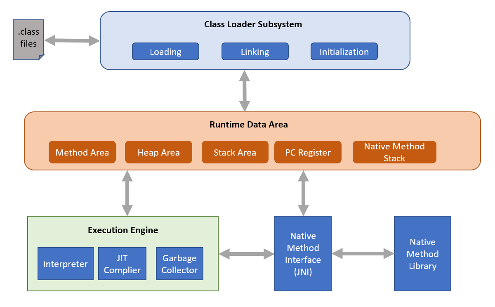

# <i><b>Important Interview Questions on Java</b></i>

### <b>1. What is a Program?</b>
A Program is defined as the series of instructions.

---
### <b>2. What is a Programming Language?</b>
A Programming Language is the set of instructions given to the computer to perform a desired task.

---

### <b>3. What is a compiler?</b>
A compiler is a software which is used to convert HLL to MLL simultaneously.

---
### <b>4. What is a assembler?</b>
An assembler is a software which is used to convert ALL to MLL.

---
### <b>5. What is an interpreter?</b>
An interpreter is a software which converts HLL to MLL line by line.

---
### <b>6. Who is the founder of Java?</b>
The Green Team of Sun Microsystems headed by James Gosling have the credits for the innovation of Java.

---
### <b>7. Why is Java a platform independent language?</b>
Java program which is written and compiled in one OS can be executed any OS. Hence, java is platform independent language.

---
### <b>8. What are the different important memory units of the computer?</b>
There are basically 3 important memory units: 
1. Hard Disk Drive
2. Random Access Memory
3. Microprocessor

---
### <b>9. Why does a computer have multiple memory units?</b>
A programmer expects the memory unit to be : 
<ul>
<li>Fast
<li>Compact
<li>Non-Volatile
<li>Less Expensive
</ul>
Since all the above features are not available in a single device we have multiple memory units which helps to achive these expectations.

---
### <b>10. What are the advantages and dis-advantages of Hard Disk Drive ?</b>
<u>Advantages:</u>
 
1.Non-Volatile 
2.Less expensive
  
<u>Dis-advantages:</u> 
 
1.Occupies More Memory 
2.Slow

---
### <b>11. What are the advantages and dis-advantages of Random Access Memory ?</b>
<u>Advantages:</u> 
 
1.Occupies Less Memory 
2.Fast
  
<u>Dis-advantages:</u>
 
1.Volatile 
2.Expensive

---
### <b>12. What is the use of Linker Software?</b>
It is used for linking the complied HLL code with the library files to make get the executable file.

---
### <b>13. What is the use of Loader Software?</b>
It is used for loading the executable file on to the RAM for execution.

---
### <b>14. What is the use of Linking-Loader Software?</b>
It is used for performing the operations of linker as well as the loader.

---
### <b>15. Explain the Architecture of JAVA.</b>

---
### <b>16. What are the reasons for Java’s success?</b>
<li>Portable</li>
<li>Freely downloadable</li>
<li>Open source</li>

---
### <b>17. What is WORA?</b>
Write Once Run Anywhere feature of Java which refers to the portability feature of java.

---
### <b>18. Why is Java called on Internet Programming language?</b>
Because of the portable feature of Java.

---
### <b>19. What is meant by open source?</b>
Open source software is such a software for which modifications and
enhancement can not only be performed by the engineers of the company but can also
be performed by free lancers or independent thinker or engineers of other company.

---
### <b>20. What is JVM?</b>
Java Virtual Machine, it is a software which accepts byte code as its input and
produces machine level code as its output and execute.

---
### <b>21. Is JVM platform independent or dependent?</b>
It is platform dependent, as its coded in c language.

---
### <b>22. What are the difference between complier and interpreter?</b>

---
### <b>23. What is JIT?</b>

Just in time compiler, part of the JVM where compilation would be done during
execution of the program in run time.

---
### <b>24. Is Java compiled or interpreted language?</b>
Java is both compiled as well as interpreted language.

---
### <b>25. Explain the architecture neutrality feature of Java</b>
If a software is capable of executing on any operating system, microprocessor
combination then it is said to be architecture neutral.

--- 
